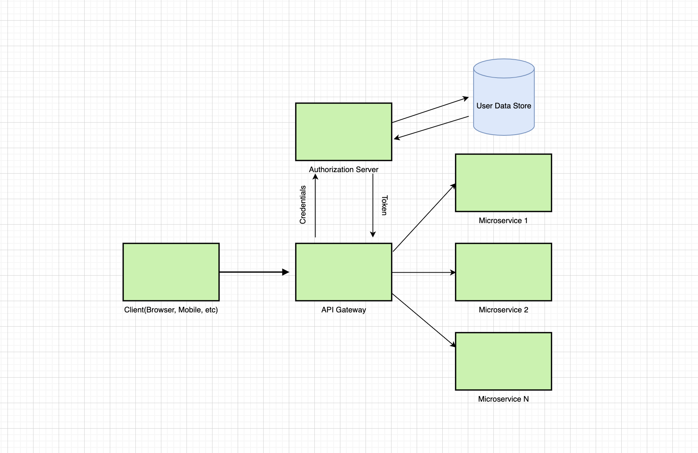

# Microservices security

There is a clear understanding that everything that is exposed to the Internet should be secured. Especially when you create software and work with sensitive user data, such as emails, phone numbers, addresses, credit cards, etc.

Here we will go through securing API Gateway with Json Web Tokens(JWT).

As far as you probably know Spring recently released an update for microservice applications, and this update is a Spring Cloud Gateway that stands in front of all of your microservices and accepts requests, and then redirects them to the corresponding service. It is also a common practice to add a security layer here, so if some unauthorized request comes in — it is not get passed to the resource microservice and it gets rejected on an API Gateway level.

# So how security should work in theory?

A client makes a request to some secured resource with no authorization. API Gateway rejects it and redirects the user to the Authorization Server to authorize himself in the system, get all required grants and then make the request again with these grants to receive information from that secured resource.

# Let’s dive into the API Gateway code to see what’s going on there:

First of all, we need the filter itself, which will be checking all the incoming requests to our API for a JWToken.

    @RefreshScope
    @Component
    public class AuthenticationFilter implements GatewayFilter {
    
        @Autowired
        private RouterValidator routerValidator;//custom route validator
        @Autowired
        private JwtUtil jwtUtil;
    
        @Override
        public Mono<Void> filter(ServerWebExchange exchange, GatewayFilterChain chain) {
            ServerHttpRequest request = exchange.getRequest();
    
            if (routerValidator.isSecured.test(request)) {
                if (this.isAuthMissing(request))
                    return this.onError(exchange, "Authorization header is missing in request", HttpStatus.UNAUTHORIZED);
    
                final String token = this.getAuthHeader(request);
    
                if (jwtUtil.isInvalid(token))
                    return this.onError(exchange, "Authorization header is invalid", HttpStatus.UNAUTHORIZED);
    
                this.populateRequestWithHeaders(exchange, token);
            }
            return chain.filter(exchange);
        }
    
    
        /*PRIVATE*/
    
        private Mono<Void> onError(ServerWebExchange exchange, String err, HttpStatus httpStatus) {
            ServerHttpResponse response = exchange.getResponse();
            response.setStatusCode(httpStatus);
            return response.setComplete();
        }
    
        private String getAuthHeader(ServerHttpRequest request) {
            return request.getHeaders().getOrEmpty("Authorization").get(0);
        }
    
        private boolean isAuthMissing(ServerHttpRequest request) {
            return !request.getHeaders().containsKey("Authorization");
        }
    
        private void populateRequestWithHeaders(ServerWebExchange exchange, String token) {
            Claims claims = jwtUtil.getAllClaimsFromToken(token);
            exchange.getRequest().mutate()
                    .header("id", String.valueOf(claims.get("id")))
                    .header("role", String.valueOf(claims.get("role")))
                    .build();
        }
    }
In the filter, we defined that we have some secured routes and ones that do not require tokens.

If a request is made to the secured route — we check for its token, see whether it is present in the request and whether it is valid(not expired)

If all these conditions are true we mutate our request on the go. This is a very useful feature of Spring Cloud Gateway as it allows us to update request data and set some additional information that is useful for us. In our case, we set the userId and role into request headers. This quite cool because now at our Resource microservice controller we can say “Hey you, give us a userId and a role of a user who is currently making this request” by doing this

@RequestHeader String userId,
@RequestHeader String role
With no need to parse the token on each microservice level to get this data. We just do this once on API Gateway level and that’s it!

Okay, that was cool!

Let’s also take a look at the RouterValidator that decides whether a request should contain a token or no:

    @Component
    public class RouterValidator {
    
        public static final List<String> openApiEndpoints= List.of(
                "/auth/register",
                "/auth/login"
        );
    
        public Predicate<ServerHttpRequest> isSecured =
                request -> openApiEndpoints
                        .stream()
                        .noneMatch(uri -> request.getURI().getPath().contains(uri));
    
    }
It simply contains a list of open routes strings and checks if the current request URI is not in the openApiEndpoints list. If not — then the token definitely must be present in the request. Otherwise — 401 Unauthorized!

We also need to somehow validate the token if it’s present. So we need some sort of JWT until that would parse that token for us and see if it is a valid one. For this, we need to create a custom JWT until service.

    @Component
    public class JwtUtil {
    
        @Value("${jwt.secret}")
        private String secret;
    
        private Key key;
    
        @PostConstruct
        public void init(){
            this.key = Keys.hmacShaKeyFor(secret.getBytes());
        }
    
        public Claims getAllClaimsFromToken(String token) {
            return Jwts.parserBuilder().setSigningKey(key).build().parseClaimsJws(token).getBody();
        }
    
        private boolean isTokenExpired(String token) {
            return this.getAllClaimsFromToken(token).getExpiration().before(new Date());
        }
    
        public boolean isInvalid(String token) {
            return this.isTokenExpired(token);
        }
    
    }

# Take a JWT, parse it, check its expiration, done.

Okay, so we have this filter and router validator, jwt util, and now we want to configure our API Gateway to understand what request to route to what microservice. There should be some set of rules for that! Let’s create it!

    @Configuration
    @EnableHystrix
    public class GatewayConfig {
    
        @Autowired
        AuthenticationFilter filter;
    
        @Bean
        public RouteLocator routes(RouteLocatorBuilder builder) {
            return builder.routes()
                    .route("user-service", r -> r.path("/users/**")
                            .filters(f -> f.filter(filter))
                            .uri("lb://user-service"))
    
                    .route("auth-service", r -> r.path("/auth/**")
                            .filters(f -> f.filter(filter))
                            .uri("lb://auth-service"))
                    .build();
        }
    
    }
So we defined a GatewayConfig with RouteLocator and tell him:

all requests that start with /users/** should be routed to user service and our custom JWT filter should be applied to each such request
all requests that start with /auth/** should be routed to auth service and our custom JWT filter should be applied to each such request too.
Okay, that’s basically it! Our AuthenticationFilter will be applied to all requests made to /users/** and /auth/** microservices, and if a request is made to a secured resource but without proper authorization — API Gateway rejects it. The browser will see the 401 Unauthorized error, will understand that it needs to be authorized in the system to access this resource, will authorize himself, gets the token, makes another request to that resource and this time system will allow him to do this with no doubts! Perfect!

Thank you for reading! Hope this helps you on your way!

We’ll keep working on the spring-cloud demos and in the upcoming guides we’ll be reviewing other items of microservice infrastructure, so stay tuned!

You can also check the source code for a better understanding of the whole picture on my GitHub account, and you can follow me on LinkedIn as well! Cheers!!